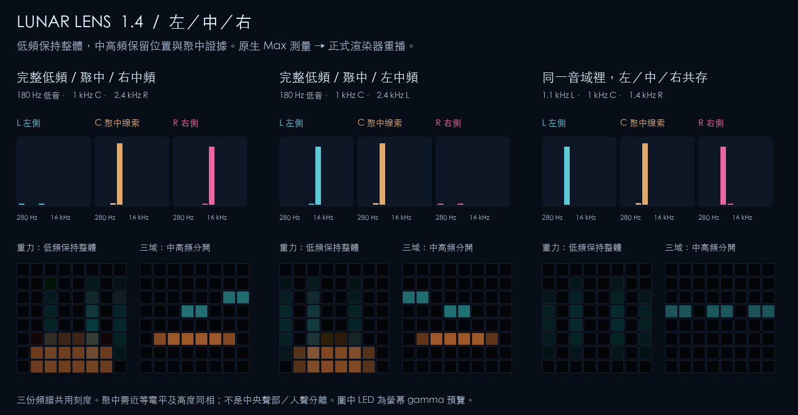

# Lunar Lens 1.4.0

**左／中／右頻譜、各行為聲場定位與第七種構圖。**

每個音域保留左右差異，再估計共同成分，避免「左低右高」被整體平衡抵消。新增 16 音域 × 左／中／右頻譜頁，以及「聲場／三域」構圖；原有六個構圖會分別定位中高頻行為，低頻保持完整。保留 1.3 的事件、轉場、獨立調參和低頻回滾規則。

Max 9 / Novation Launchpad Pro MK3。播放任意錄音或接即時輸入；原速 1×，沒有 swing、量化、歌名判斷或逐曲提示點。分析、燈光與觸控效果預設全部使用 Max 原生功能。



[原有六種構圖與五行為預覽（1.3）](media/preview.png)

[構圖轉場與事件示範](media/transitions-and-events.mp4) · [六構圖動態（1.1 設計參考）](media/roles-in-motion.mp4) · [同音域行為對照](media/behaviour-comparison.png) · [已接受事件的力度渲染參考（1.2）](media/impact-weights.png) · [觸控聲音錄音](media/touch-feedback-demo.mp3) · [驗證紀錄](docs/驗證紀錄.md)

## 開始使用

1. 保留完整資料夾，用 **Max 9** 開啟 **lunar-lens.maxproj**。主視窗未出現時，開 **patchers/Lunar Lens.maxpat**。
2. 按 **載入音訊**，或把 WAV / AIFF / MP3 拖入 **DROP AUDIO HERE**。**DEMO** 是原創合成器片段，走相同路徑。
3. 按 **PLAY**；要聆聽時，把 **聲音 OFF** 切成 **聲音 ON**。Master 預設 40%；右上 **音訊設定** 選擇裝置。
4. 插上 Launchpad Pro MK3，按 **重掃**。MIDI IN / LED OUT 選 **Launchpad Pro MK3 LPProMK3 MIDI**，再按 **CONNECT MK3**。
5. 點按 8×8 產生局部暖光與波紋；按住移動形體、改變音色；壓力加強效果。滑鼠按住並上下拖曳可模擬壓力。

沒有硬體也能使用預覽。離開前按 **歸還設備**，或關閉主 patch。連線須通過型號與 Programmer layout 17 回覆確認。

1.3 以《Blossoms Bring an Old Friend》和《ヰ世界の宝石譚》原速檢查事件引擎。1.4 另有原生聲場校準及整曲運行紀錄，見本輪驗證。原始錄音不收進 GitHub 或封裝。事件是聲學變化估計，尚沒有逐事件人工標註的準確率證據；原有版本保留為 Git tag／本機歷史 ZIP。

## 聲音行為

| 角色 | 分析的內容 | 視覺作用 |
| --- | --- | --- |
| **衝擊 IMPACT** | 可調低頻的局部起音、獨立力度、能量佔比 | 先在起音處短促亮起；輕擊較暗、短，重擊較亮、尾跡較長 |
| **地基 BODY** | 持續低頻能量 | 有面積與厚度的形體，延續、變重和退去 |
| **前景 PHRASE** | 中頻輪廓變化、短時調制與起音 | 行走、交替、穿越或跳接，有分句感 |
| **鋪陳 BED** | 中頻各頻帶的持續底層與穩定性 | 緩慢光幕、經線、外框或兩體間的連結 |
| **細節 DETAIL** | 高頻短事件和少量持續量 | 稀疏短點，消退比其他角色快 |

**人聲與 Pad 即使同在中頻，也不再全部送進同一條線。** 前景與鋪陳是兩條可以同時存在的估計。介面另顯示「起音／延續／活動／退去／休止」，可按 **獨看** 比較，原音繼續播放。

這是聲音行為分析。它不能保證把人聲和 Pad 分離：長母音可能成為鋪陳，顫動的 Pad 可能成為前景；其他有類似行為的聲音也會進入同一層。沒有語音、樂器或音高辨識模型。

## 七種構圖、六套配色

| 構圖 | 空間組織 |
| --- | --- |
| **重力／沉積** | 底部質量、向上的衝擊、上方前景軌跡與側邊持續光 |
| **天體／公轉** | 中心月體、外圍鋪陳光環、沿軌道移動的前景衛星 |
| **織光／經緯** | 兩側低頻支柱、持續縱線、橫向前景與掃描衝擊 |
| **門廊／縱深** | 方形門框、向外展開的方形衝擊、沿深度穿行的前景 |
| **雙生／呼應** | 兩個不對稱的低頻形體、交替前景、緩慢連結與雙中心衝擊 |
| **拼光／碎片** | 分離的 2×2 拼塊、跨塊前景、斜向衝擊與間隙鋪陳 |
| **聲場／三域** | 低頻是一個完整基座；中高頻依左／聚中／右分布，保留暗縫與相對強弱 |

右上配色按鈕可在「隨構圖」和 **琥珀冰川、月夜紫羅蘭、翡翠珊瑚、鈷藍熔岩、蘭花青檸、桃紅電光** 之間循環。顏色各有固定角色，沒有持續彩虹循環。切換配色保留幾何和聲音歷史。

## 左／中／右聲場

左側按 **左 / 中 / 右** 打開中高頻頻譜頁：280 Hz–16 kHz 的三圖共用功率刻度，下方顯示前景、鋪陳、細節的空間比例。低頻 IMPACT 與 BODY 始終保持單一形體，不拆成左右。

**聲場位置** 預設 85%，控制中高頻各層的定位；0% 可與原構圖比較。**側向細節** 預設 65%，提高較弱側向成分的可見度，並讓中頻的三個位置更分明。兩者都只改視覺，不改量測數據、起音門檻或原音。第七個構圖直接呈現中高頻三列與完整低頻基座。

「聚中」要求左右電平接近且高度同相一致，**兩邊都有聲音並不足以聚中**。它是聲像線索，不是中央聲部或人聲分離；同一訊號複製到兩邊和單一居中音源也無法由立體聲錄音區分。PHRASE 偏重變動、BED 偏重延續。[算法、單位和限制](docs/立體聲頻譜.md)

## 五個行為獨立調整

點每個行為旁的 **調**，或打開 **行為 / 事件 → 行為**。上方選擇 IMPACT、BODY、PHRASE、BED、DETAIL，每個行為都有自己的設定：

| 控制 | 範圍 | 作用 |
| --- | --- | --- |
| 起音靈敏度／行為響應 | 0.4–2.5× | IMPACT 改原起音門檻；其他行為改響應程度 |
| 視覺份量 | 0–2× | 該行為在燈光中的份量；0 可關閉該層 |
| 形體寬度 | 0.5–1.8× | 該層水平方向的空間尺度 |
| 延續／殘影 | 0.3–3× | 該層的視覺延續時間 |
| 分析音域 | 各行為獨立 | 下方調整頻寬或納入的音域 |

IMPACT 使用 **20–160 Hz 下限、70–400 Hz 上限**，預設 35–160 Hz；還可調 80–400 ms 最短間隔，預設 160 ms。其他四個行為可複選八個重疊頻帶作為分析音域；這是粗音域選擇，並非任意 Hz 的精密濾波器。選擇自訂音域時，該行為會重新觀察所選音域的活動／持續性。改變分析音域不改播放 EQ。

**只還原這個行為** 不影響其他四個；**獨看 / 比較** 保持原音。設定在當次開啟的專案中保留，切換構圖不會重設；目前不自動寫入跨開啟 preset。

低頻始終要通過 **快速／背景能量比 > 1.35**、短時上升量、支持度與最短間隔；能量比回落至 1.025 以下或安靜後才能重新準備。新增結構事件不會繞過它。原有低頻在強 Bass 上仍可能漏掉小重音，這是回滾保留的取捨。

## 事件與測量

**行為 / 事件 → 事件** 顯示 FFT 頻譜重心、展寬、平坦度、分散度、0.4／3 秒能量、左右相關及起音密度。下方列出最近的音色變化、行為進退、能量累積／釋放和結構變化候選。

這些事件有時間、強度、啟發式信心與依據，與繪圖分開。音色變化控制細節質感；前景進入產生分句動作；結構候選讓空間展開、鋪陳短暫留下暗縫；能量釋放讓背景退去。**事件視覺份量** 可調 0–100%，0 便於與原有連續響應比較。原有起音仍然工作。

結構判斷至少需要音域分布與另外一項聲學證據共同改變，且持續約 450 ms。它不是主歌／副歌或人聲辨識，也不等同 Ozone 的學習模型。**原始診斷** 頁保留八段起音與 LOW 能量比，供排查問題，而不是主要操作入口。

## 構圖轉場

主構圖頁的 **構圖轉場** 預設 **0.85 秒**，可調 **0–3 秒**。構圖、配色、獨看切換時，背景依不同方向展開混合；0 是硬切。連續切換會從當前畫面重新轉向。低頻 IMPACT 和觸控保持即時，Blackout 立即全黑。

## 觸控聲音

預設 **觸控聲音效果 ON，效果深度 85%**。只有按住時混入處理：

- 上下位置：兩級低通，從暗、厚到明亮。
- 左右位置：空間衰減與顆粒深度。
- 力度／壓力：乾濕比例；右側用力按會增加取樣保持與量化顆粒。
- 310 / 430 ms 左右交叉延遲、四線阻尼回授空間提供深度。

一根手指即可明顯改變音色；多點取壓力加權中心。鬆開以約 60 ms 控制平滑回到原音。效果關閉時仍有燈光互動。原音在效果前分析，觸控的延遲不會自行生成新的假起音。

## 其他控制

**各行為的視覺份量與形體寬度** 改變該層的重量和尺度；**光線亮度** 配合環境調整；**殘影長度** 保留各層不同的消退速度；**細節密度** 控制短點數量；**感應靈敏度** 控制整體視覺響應。

**STOP** 回到零、清除手勢與畫面；**PAUSE** 暫停；**RESTART** 從頭開始；進度列拖曳後繼續播放。**BLACKOUT** 覆蓋畫面與所有 LED。**凍結** 保留背景，觸控仍有效。**還原** 保留播放、音量、路由與 Impact 校準。

## Launchpad 按鍵

| 位置／MIDI CC | 功能 |
| --- | --- |
| 上排 91 / 92 / 93 / 94 | Play/Pause / Stop / Restart / Blackout |
| 上排 95 / 96 / 97 / 98 | 凍結 / 觸控效果 / 長短殘影 / 清除 |
| 右側 89 / 79 / 69 / 59 / 49 / 39 | 原有六種構圖，由上到下 |
| 右側 29 / 19 | 循環配色 / 行為與事件面板 |
| 下方兩排，第 1 格：1 或 101 | 全層 |
| 下方兩排，第 2–6 格：2–6 或 102–106 | 衝擊 / 地基 / 前景 / 鋪陳 / 細節；再按回全層 |
| 下方兩排，第 7 格：7 或 107 | 循環低頻重量 |
| 下方兩排，第 8 格：8 或 108 | 還原 |

第七個「聲場／三域」在 Max 選擇，硬體同步顯示。

支援 velocity、Note Off、poly aftertouch、channel pressure、running status。按鍵會顯示選中狀態或短暫回饋。8×8 左下為 Note 11，右上為 88。

## VST3 / Audio Unit

按 **VST / AU → 選擇效果器**，選本機 `.vst3` 或 `.component`，等待就緒後 **啟用**。**插件介面** 可換 preset 和調參，**BYPASS** 回到原生路徑。也提供 preset 讀寫。

此專案播放錄音，因此插件槽是音訊效果器。無效插件或合成器不能切斷原始音訊。第三方插件延遲尚未補償到視覺。預設無第三方依賴。

## 即時輸入、錄音與排錯

切換 **即時輸入 1/2**，在音訊設定選裝置後 PLAY。切換來源會停止並關閉監聽。擷取其他軟體需要自行提供音訊回送裝置；專案不改 macOS 全域路由。

**錄音** 選 WAV 路徑後記錄效果後、Master 後的立體聲，再按結束。監聽開關不影響錄音。

沒有聲音先確認音檔、PLAY、聲音 ON、Master 和音訊裝置；沒有硬體端口先檢查 USB，再重掃並選 **LPProMK3 MIDI**，避開 DIN / DAW。其他程式控制燈光時，先關閉該控制程式再 CONNECT。

## 分層開發與 GitHub

私人倉庫：[Mizimo/lunar-lens](https://github.com/Mizimo/lunar-lens)。`v1.2.1` 是低頻回滾基線；`v1.3.0` 保留事件與轉場版；`v1.4.0` 是本次聲場迭代，不覆寫舊版。

```sh
npm run build
npm test
npm run package
python3 scripts/verify-release.py
```

Max 端使用原生物件，JavaScript 測試沒有 npm 第三方依賴。選用的音訊／影片驗證腳本需要 Python、NumPy／Pillow 與 ffmpeg，執行專案不需要它們。

[工程分層](docs/工程設計.md) · [量測、事件契約與研究](docs/事件引擎與轉場.md) · [本輪驗證](docs/驗證紀錄.md) · [真實混音事件時間線](media/event-timelines.png)

`docs/ci-workflow.yml.example` 是 GitHub Actions 回歸範本。目前推送憑證沒有 workflow 權限，範本未啟用；日後可由有權限的維護者放到 `.github/workflows/verify.yml`。本輪建置、測試與封裝驗證都已在本機執行。
