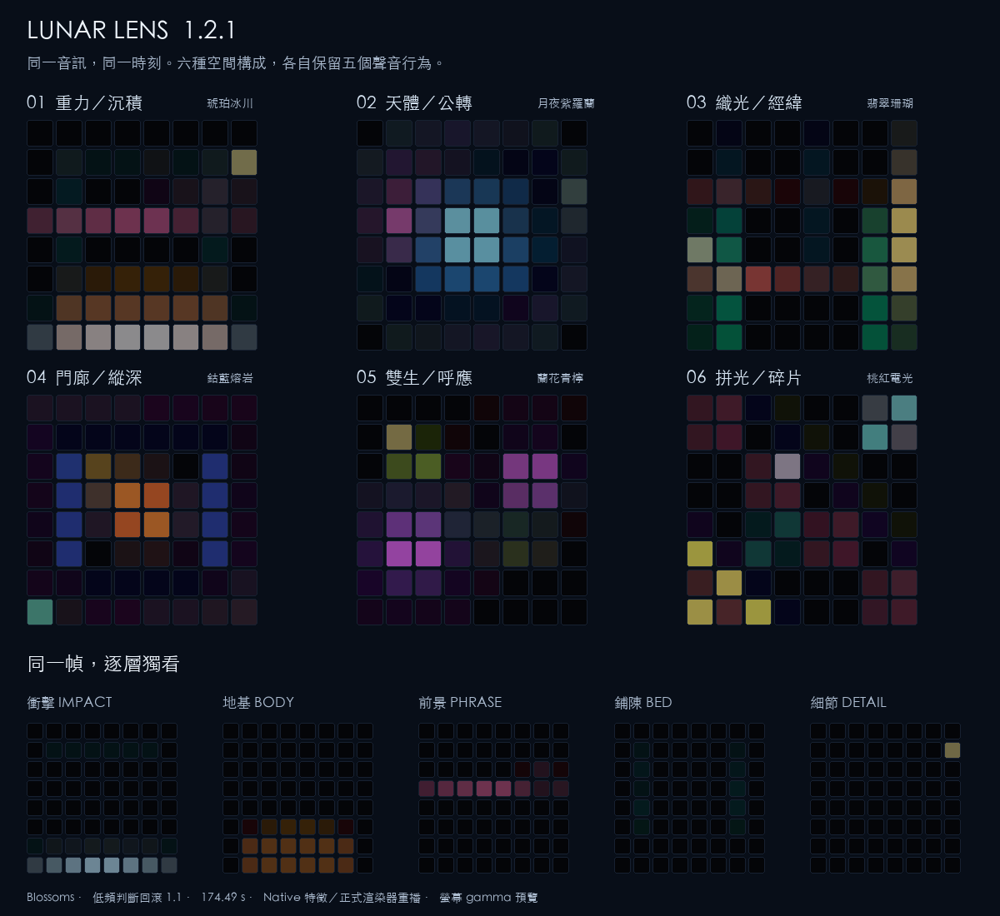

# Lunar Lens 1.2.1

**低頻 IMPACT 已回滾到 1.1 的能量比判斷；其他 1.2 功能保留。**

使用者在《Blossoms》的複雜混音中確認新版誤觸增加，因此恢復快速／背景能量比 > 1.35、原有起音門檻與重新觸發條件。衝擊力度、其他頻段的獨立動態、六種構圖、配色、觸控效果及快速預覽維持 1.2。

Max 9 / Novation Launchpad Pro MK3。播放任意錄音或接即時輸入；原速 1×，沒有 swing、量化、歌名判斷或逐曲提示點。分析、燈光與觸控效果預設全部使用 Max 原生功能。

[六構圖動態（1.1 設計參考）](media/roles-in-motion.mp4) · [同音域行為對照](media/behaviour-comparison.png) · [已接受事件的力度渲染參考（1.2）](media/impact-weights.png) · [觸控聲音錄音](media/touch-feedback-demo.mp3) · [驗證紀錄](docs/驗證紀錄.md)

## 開始使用

1. 保留完整資料夾，用 **Max 9** 開啟 **lunar-lens.maxproj**。主視窗未出現時，開 **patchers/Lunar Lens.maxpat**。
2. 按 **載入音訊**，或把 WAV / AIFF / MP3 拖入 **DROP AUDIO HERE**。**DEMO** 是原創合成器片段，走相同路徑。
3. 按 **PLAY**；要聆聽時，把 **聲音 OFF** 切成 **聲音 ON**。Master 預設 40%；右上 **音訊設定** 選擇裝置。
4. 插上 Launchpad Pro MK3，按 **重掃**。MIDI IN / LED OUT 選 **Launchpad Pro MK3 LPProMK3 MIDI**，再按 **CONNECT MK3**。
5. 點按 8×8 產生局部暖光與波紋；按住移動形體、改變音色；壓力加強效果。滑鼠按住並上下拖曳可模擬壓力。

沒有硬體也能使用預覽。離開前按 **歸還設備**，或關閉主 patch。連線須通過型號與 Programmer layout 17 回覆確認。

本輪以《Blossoms Bring an Old Friend》作回滾後的全曲運行檢查，並用封存的混音特徵確認偵測邏輯回到 1.1；這不等於逐拍準確率驗收。原始錄音不收進封裝；請透過載入音訊開啟。舊 **Lunar Departure**、**Lunar Lens v1.0.0 / v1.1.0 / v1.2.0** 封裝均保留。

## 聲音行為

| 角色 | 分析的內容 | 視覺作用 |
| --- | --- | --- |
| **衝擊 IMPACT** | 可調低頻的局部起音、獨立力度、能量佔比 | 先在起音處短促亮起；輕擊較暗、短，重擊較亮、尾跡較長 |
| **地基 BODY** | 持續低頻能量 | 有面積與厚度的形體，延續、變重和退去 |
| **前景 PHRASE** | 中頻輪廓變化、短時調制與起音 | 行走、交替、穿越或跳接，有分句感 |
| **鋪陳 BED** | 中頻各頻帶的持續底層與穩定性 | 緩慢光幕、經線、外框或兩體間的連結 |
| **細節 DETAIL** | 高頻短事件和少量持續量 | 稀疏短點，消退比其他角色快 |

**人聲與 Pad 即使同在中頻，也不再全部送進同一條線。** 前景與鋪陳是兩條可以同時存在的估計。介面另顯示「起音／延續／活動／退去／休止」，可按 **獨看** 比較，原音繼續播放。

這是聲音行為分析。它不能保證把人聲和 Pad 分離：長母音可能成為鋪陳，顫動的 Pad 可能成為前景；其他有類似行為的聲音也會進入同一層。沒有語音、樂器或音高辨識模型。

## 六種構圖、六套配色

| 構圖 | 空間組織 |
| --- | --- |
| **重力／沉積** | 底部質量、向上的衝擊、上方前景軌跡與側邊持續光 |
| **天體／公轉** | 中心月體、外圍鋪陳光環、沿軌道移動的前景衛星 |
| **織光／經緯** | 兩側低頻支柱、持續縱線、橫向前景與掃描衝擊 |
| **門廊／縱深** | 方形門框、向外展開的方形衝擊、沿深度穿行的前景 |
| **雙生／呼應** | 兩個不對稱的低頻形體、交替前景、緩慢連結與雙中心衝擊 |
| **拼光／碎片** | 分離的 2×2 拼塊、跨塊前景、斜向衝擊與間隙鋪陳 |

右上配色按鈕可在「隨構圖」和 **琥珀冰川、月夜紫羅蘭、翡翠珊瑚、鈷藍熔岩、蘭花青檸、桃紅電光** 之間循環。顏色各有固定角色，沒有持續彩虹循環。切換配色保留幾何和聲音歷史。

## Impact 頻段與自適應

按左側 **分頻起音設定**，右側會顯示：

| 控制 | 範圍／預設 | 作用 |
| --- | --- | --- |
| **下限** | 20–160 Hz／35 Hz | 排除更低的轟鳴；和上限共同決定 bandwidth |
| **上限** | 70–400 Hz／160 Hz | 納入較高的衝擊，或縮窄範圍減少其他聲音干擾 |
| **觸發靈敏度** | 0.4–2.5×／1× | 降低或提高相對起音門檻 |
| **最短間隔** | 80–400 ms／160 ms | 防止一次聲響重觸，也可放行更快的連擊 |

上下限至少相隔 25 Hz。濾波係數平滑移動，調整後約 300 ms 暫停衝擊觸發，避免參數變化製造假事件。顯示當下的上升量、實際門檻、事件次數與最近一次力度。按面板的 **1–8 / LOW** 選擇監看頻段，也可點左側八條小柱。亮柱是持續能量，上方短閃是該頻段自己的起音。

**低頻 IMPACT 的觸發判斷恢復 1.1。** 快速／背景能量比必須大於 **1.35**，同時通過原本的短時上升量門檻、頻段支持度及最短間隔；能量比回落到 1.025 以下或安靜後才重新準備。移除新版以 DSP 短峰或能量跳升繞過這個條件的補回路徑。右側 LOW 面板顯示當前能量比與 1.35 門檻。

**每段動態與輕重表現保留。** 八個固定頻段仍各自分析起音，參與 BODY／PHRASE／DETAIL；它們的受限自適應沒有回滾。低頻只在事件已被接受後，使用 1.2 的連續力度與較快畫面回應。舊低頻門檻仍可能漏掉強 Bass 上的小重音，這是本次回滾保留的取捨。四個滑桿只調整低頻偵測，播放聲音的 EQ 不變。

誤觸時先縮窄頻段或降低靈敏度；漏掉快速連擊時縮短最短間隔；漏掉較高位置的衝擊時提高上限。Bass 換音若具有短促起音，仍可能觸發 Impact。**恢復偵測** 還原四項參數；一般 **還原** 保留你校準的頻段。

## 觸控聲音

預設 **觸控聲音效果 ON，效果深度 85%**。只有按住時混入處理：

- 上下位置：兩級低通，從暗、厚到明亮。
- 左右位置：空間衰減與顆粒深度。
- 力度／壓力：乾濕比例；右側用力按會增加取樣保持與量化顆粒。
- 310 / 430 ms 左右交叉延遲、四線阻尼回授空間提供深度。

一根手指即可明顯改變音色；多點取壓力加權中心。鬆開以約 60 ms 控制平滑回到原音。效果關閉時仍有燈光互動。原音在效果前分析，觸控的延遲不會自行生成新的假起音。

## 其他控制

**低頻重量** 改變低頻面積與衝擊尺度；**光線亮度** 配合環境調整；**殘影長度** 保留各層不同的消退速度；**細節密度** 控制短點數量；**感應靈敏度** 控制整體視覺響應。

**STOP** 回到零、清除手勢與畫面；**PAUSE** 暫停；**RESTART** 從頭開始；進度列拖曳後繼續播放。**BLACKOUT** 覆蓋畫面與所有 LED。**凍結** 保留背景，觸控仍有效。**還原** 保留播放、音量、路由與 Impact 校準。

## Launchpad 按鍵

| 位置／MIDI CC | 功能 |
| --- | --- |
| 上排 91 / 92 / 93 / 94 | Play/Pause / Stop / Restart / Blackout |
| 上排 95 / 96 / 97 / 98 | 凍結 / 觸控效果 / 長短殘影 / 清除 |
| 右側 89 / 79 / 69 / 59 / 49 / 39 | 六種構圖，由上到下 |
| 右側 29 / 19 | 循環配色 / 分頻起音面板 |
| 下方兩排，第 1 格：1 或 101 | 全層 |
| 下方兩排，第 2–6 格：2–6 或 102–106 | 衝擊 / 地基 / 前景 / 鋪陳 / 細節；再按回全層 |
| 下方兩排，第 7 格：7 或 107 | 循環低頻重量 |
| 下方兩排，第 8 格：8 或 108 | 還原 |

支援 velocity、Note Off、poly aftertouch、channel pressure、running status。按鍵會顯示選中狀態或短暫回饋。8×8 左下為 Note 11，右上為 88。

## VST3 / Audio Unit

按 **VST / AU → 選擇效果器**，選本機 `.vst3` 或 `.component`，等待就緒後 **啟用**。**插件介面** 可換 preset 和調參，**BYPASS** 回到原生路徑。也提供 preset 讀寫。

此專案播放錄音，因此插件槽是音訊效果器。無效插件或合成器不能切斷原始音訊。第三方插件延遲尚未補償到視覺。預設無第三方依賴。

## 即時輸入、錄音與排錯

切換 **即時輸入 1/2**，在音訊設定選裝置後 PLAY。切換來源會停止並關閉監聽。擷取其他軟體需要自行提供音訊回送裝置；專案不改 macOS 全域路由。

**錄音** 選 WAV 路徑後記錄效果後、Master 後的立體聲，再按結束。監聽開關不影響錄音。

沒有聲音先確認音檔、PLAY、聲音 ON、Master 和音訊裝置；沒有硬體端口先檢查 USB，再重掃並選 **LPProMK3 MIDI**，避開 DIN / DAW。其他程式控制燈光時，先關閉該控制程式再 CONNECT。

## 開發

運行只需 Max；重建需要 Node.js，無 npm 依賴：

    npm run build
    npm test
    npm run package

**關閉主 patch → 重建 → 重新開啟**。維護來源是 `code/`、`scripts/controller-core.js` 與 `scripts/analysis-source.mjs`；`patchers/` 是生成結果。驗收腳本另外使用 Python、numpy、Pillow、ffmpeg。

詳見 [分頻動態研究](docs/分頻動態研究.md)、[工程設計](docs/工程設計.md)、[視覺與分析研究](docs/視覺分層研究.md)、[驗證紀錄](docs/驗證紀錄.md)。本機驗收橋接只在 `tmp/`；正式封裝不帶網路接收器。歷史驗收位於 `docs/archive-v1.0/`、`docs/archive-v1.1/` 與 `docs/archive-v1.2/`，不能當作新版驗收。
